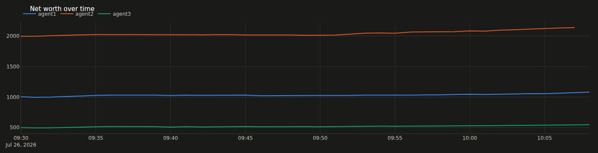
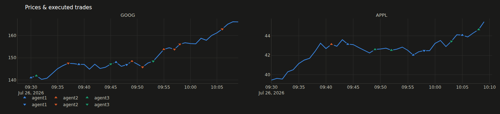

# TradeAI Dashboard

A live, web-based dashboard to visualize the trading simulation: KPI tiles,
agent leaderboard, net-worth curves, and price charts with each agent's
buy/sell markers — all updating in real time, in a full-width dark layout.

> **It does not touch the simulation logic.** The dashboard is a *read-only
> observer*: it only parses the log the simulation already writes
> (`src_cpp/bourse.log`). You can run it while a simulation is live, or after a
> run to replay the result.

---

## What you see

| Panel | Content |
|-------|---------|
| **KPI tiles** | Ticks processed, active agents, trades executed, rejected orders, and the current best performer. |
| **Leaderboard** | Agents ranked by net worth, with return %, cash, holdings value, and buy/sell/reject counts. |
| **Net worth over time** | Each agent's equity curve (cash + holdings), with a dotted line at their starting capital. |
| **Prices & trades** | One price chart per ticker (GOOG, APPL…) with ▲ BUY / ▼ SELL markers per agent, placed at the executed price. |

The header shows the TradeAI logo, a **● LIVE / ● FINISHED / ● WAITING** badge, and the tick count.

### Preview




---

## Install (once)

```bash
pip install --break-system-packages -r dashboard/requirements.txt
```

## Run

Two terminals (both in WSL):

**Terminal 1 — start the dashboard:**
```bash
cd /mnt/c/Users/X515/Documents/GitHub/TradeAI/dashboard
python3 app.py
# then open http://127.0.0.1:8050 in your browser
```

**Terminal 2 — run a simulation (the dashboard updates by itself):**
```bash
cd /mnt/c/Users/X515/Documents/GitHub/TradeAI
./run.sh --generate dur=1 file=data/small.csv
./run.sh --train data/small.csv
```

Watch the charts fill up live while the simulation runs.

---

## Options

- **Custom log file** (e.g. to replay another run):
  ```bash
  TRADEAI_LOG=/path/to/bourse.log python3 app.py
  ```
- **Refresh rate / colors / port**: edit the constants at the top of
  [`app.py`](app.py) (`REFRESH_MS`, `AGENT_COLORS`, the `app.run(... port=8050)` call).

## Files

| File | Role |
|------|------|
| [`log_parser.py`](log_parser.py) | Parses `bourse.log` into a structured `SimState` (prices, agents, trades). Pure, no simulation imports. |
| [`app.py`](app.py) | The Dash web app: builds the figures/KPI tiles and refreshes on a timer. |
| [`assets/style.css`](assets/style.css) | Layout, cards, and the leaderboard table style (auto-loaded by Dash). |
| [`assets/logo.svg`](assets/logo.svg) | The header logo mark. |

## Notes

- Starting capital per agent is defined in `log_parser.py` (`INITIAL_CASH`) to
  match `src_python/main.py`. Update it there if you change the agents.
- Net worth = cash (authoritative, from each `OK` acknowledgement) + holdings
  valued at the last seen price. Holdings are reconstructed from executed
  trades, so treat them as a best-effort estimate.
